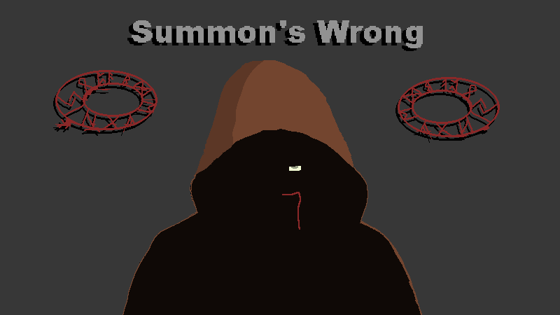

# Ludum Dare 55

[Ludum Dare Page](https://ldjam.com/events/ludum-dare/55/$388777)

## Description

CANST THOU AFFORD THE PRICE OF HUBRIS

Battle your way through an unending stream of rooms as you attempt to escape the Temple of Jamir'okai. Use your new-found summoning skills to defeat the karmic demons who are drawn to your insatiable greed. Can you survive? Or have the consequences of your actions caught up with you?

## Technologies

- Game Engine - [Godot](https://godotengine.org/)
- Pixal Art - [Aseprite](https://www.aseprite.org/)

## Contributors

### Lewis McNeill (_Programming_) - [GitHub](https://github.com/lewis785)

### Nicholas Robinson (_Programming_) - [GitHub](https://github.com/nkrobinson)

### Jack Foster (_Programming_, _Artwork_) - [GitHub](https://github.com/zindarn)

### Sean Robertson (_Artwork_, _Music_)